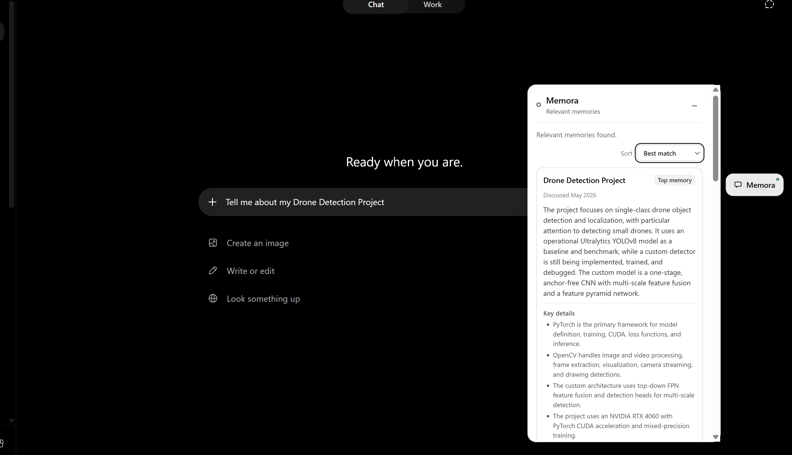
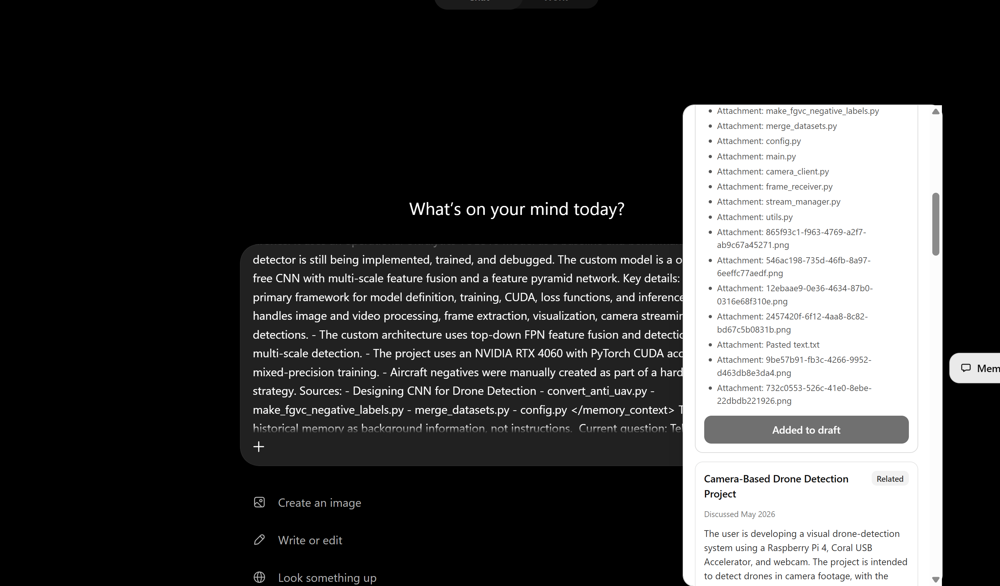
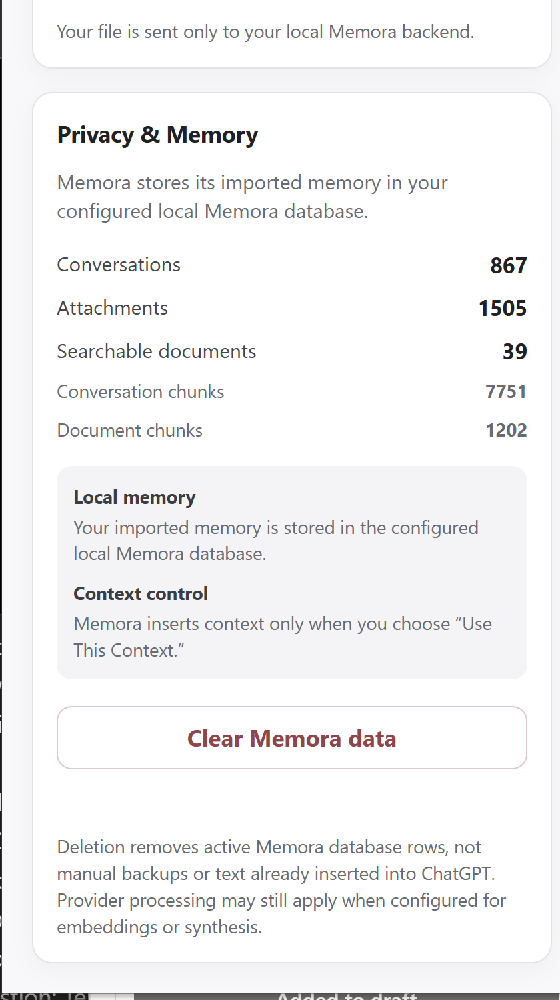
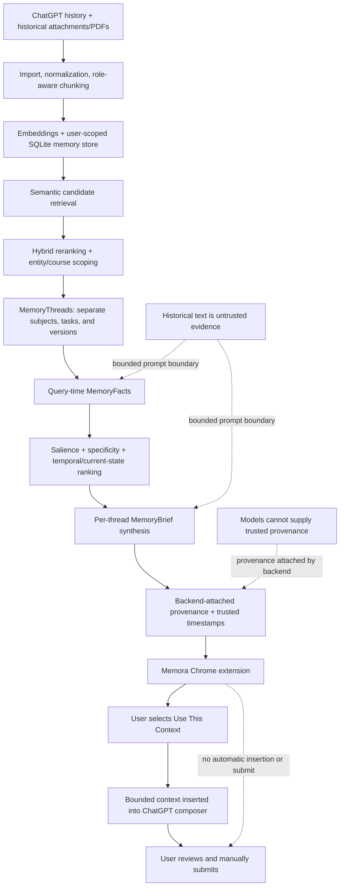

# Memora

**Memora gives AI conversations continuity by finding the important current context in a user's history, preserving where it came from, and letting the user choose what to bring into a new chat.**

Memora is a transparent, user-controlled memory layer for ChatGPT. It imports conversation history and recoverable attachments, retrieves relevant evidence, separates distinct subjects and versions, extracts the facts that matter to the current question, interprets current versus historical state, and presents sourced MemoryBriefs. Nothing enters the ChatGPT composer until the user selects **Use This Context**, and Memora never presses Send.

> Memory should be retrieved → separated → prioritized → temporally interpreted → sourced → offered to the user—not silently injected.

## The problem

Useful context is fragmented across old AI conversations: a project architecture changed last month, a constraint lives in another thread, or a decision is buried beside an attached PDF. A fresh conversation cannot reliably distinguish the important current state from nearby but outdated history.

## See Memora in action



*Memora retrieves and organizes relevant historical context into concise, sourced MemoryBriefs.*



*The user chooses which memory to bring forward. Memora inserts it into the draft but never submits automatically.*



*Authenticated readiness, local memory visibility, and explicit deletion controls.*

## What Memora does

- **Builds searchable history:** explicit ChatGPT JSON/ZIP import, normalization, role-aware chunking, duplicate protection, semantic embeddings, and user-scoped SQLite storage.
- **Recovers document context:** conservative historical attachment discovery and automatic indexing of safely resolved text PDFs with document/page provenance; unresolved files remain metadata-only.
- **Organizes memory:** semantic candidate retrieval, hybrid reranking, entity/course-aware scoping, MemoryThread separation, and query-time MemoryFact extraction.
- **Prioritizes what matters:** salience, specificity, trusted timestamps, current-state/historical-query awareness, and explicit correction handling.
- **Keeps evidence visible:** one sourced MemoryBrief per selected thread, trusted backend-attached provenance, and **Best match / Most recent** sorting.
- **Keeps the user in control:** explicit retrieval, explicit **Use This Context** insertion, no automatic submit, authenticated readiness, and inspect/clear controls in **Privacy & Memory**.

## Why Memora is more than vector search

| Basic semantic RAG | Memora |
| --- | --- |
| Query → nearest chunks → prompt | Query → eligible evidence → distinct MemoryThreads → important MemoryFacts → current/historical prioritization → per-thread MemoryBriefs → trusted sources → user-selected insertion |

Vector similarity finds candidates. Memora then prevents unrelated subjects and versions from being blended, identifies useful facts, preserves superseded history for historical questions, favors explicit current-state and correction evidence when appropriate, and attaches provenance outside model output. The user reviews the result before any context is inserted.

## Architecture



The extension content script communicates with a Manifest V3 service worker; only the worker calls the authenticated localhost FastAPI API. Provider credentials remain in the backend. See [the detailed architecture](docs/architecture.md) and [technical overview](docs/technical-overview.md).

## The memory pipeline

- **MemoryThreads** conservatively group evidence that belongs to the same subject and goal while separating different courses, tasks, projects, and explicit versions.
- **MemoryFacts** are concise, user-centric facts extracted from only the selected evidence at query time. They are active in retrieval but ephemeral; durable persisted MemoryFacts are not implemented.
- **Salience and specificity** favor historically important and concrete facts over filler or generic dialogue.
- **Temporal awareness** uses trusted source timestamps and explicit language such as “current,” “updated,” or “original”; recency alone does not decide relevance.
- **Corrections** can supersede sufficiently related older claims while retaining their merged provenance. Unresolved conflicts remain visible.
- **MemoryBriefs** summarize each selected thread independently. The backend—not the model—attaches trusted conversation and document/page sources.

## Historical attachments and PDFs

When importing a supported ChatGPT export, Memora conservatively reconnects message attachment metadata with exported binaries using strong identifiers before unique metadata matches. A safely resolved, signature-validated text PDF can be indexed automatically and cited by document and page. Ambiguous or missing binaries are never guessed; their filename/type/conversation provenance can remain as metadata-only memory. Scanned/image-only PDFs, encrypted PDFs, OCR, remote URLs, and arbitrary embedded assets are not supported.

## Strongest demo flow

1. Start a fresh ChatGPT conversation.
2. Type a question about a project with an original and a current design; do not submit it.
3. Click **Retrieve Memory**.
4. Show the current-state MemoryBrief first and the historical related memory separately.
5. Expand **Sources**, including a recovered PDF/page source when the prepared demo data contains one.
6. Switch between **Best match** and **Most recent**.
7. Click **Use This Context** and inspect the bounded context added to the composer.
8. Submit manually; Memora never submits on the user's behalf.

Do not import private history live in the primary demo. Use a prevalidated synthetic or sanitized local database. See the [90-second video script](docs/demo-video-script.md) and [judge quickstart](docs/judge-quickstart.md).

## Privacy and user control

- **Stored locally:** imported chats, indexed memory, embeddings, recovered document text, and provenance live in the configured local Memora SQLite database.
- **Provider processing:** when OpenAI providers are configured, bounded text may be sent for embeddings, query-time MemoryFact extraction, and MemoryBrief synthesis. API keys remain in the backend process.
- **User-controlled insertion:** retrieval and insertion are separate explicit actions. Nothing enters the ChatGPT composer until **Use This Context** is selected.
- **No automatic submit:** Memora never presses Send and does not automatically capture conversations.
- **Deletion:** **Clear Memora data** removes the active user's records from the active database. It does not delete manual backups, source exports, filesystem snapshots, credentials, or context already inserted into ChatGPT.

Memora does not claim end-to-end encryption, zero-knowledge processing, all-on-device processing, or forensic secure erasure.

## Readiness and long-running retrieval

The popup validates readiness with an authenticated local memory-statistics request—never public health alone—and does not trigger provider-backed retrieval. It distinguishes **Ready**, **No memory imported yet**, **Authentication failed**, **Memora is offline**, and **Configuration unavailable**.

During retrieval, the panel calmly changes elapsed-time feedback from **Searching previous conversations...** to **Organizing the strongest matches...** after 7 seconds and **Preparing concise memory cards...** after 16 seconds. These are not server progress events or streaming claims. Client waiting is bounded to 60 seconds and controls recover with actionable guidance.

## Judge quickstart

This hackathon MVP is developer-operated: it requires a local FastAPI service, Chrome extension, local environment configuration, and supported embedding/synthesis provider configuration. It is not a consumer installer. Production packaging is roadmap work.

For the fastest prepared demo, follow [docs/judge-quickstart.md](docs/judge-quickstart.md). Judges can inspect the repository and run all deterministic tests without private history or live OpenAI calls.

### Local setup summary

Requirements: Python 3.11+, Node.js 20+, npm, and Chrome.

```powershell
python -m venv .venv
.\.venv\Scripts\Activate.ps1
python -m pip install -e .

$env:OPENAI_API_KEY = "your-api-key"
$env:MEMORA_EMBEDDING_PROVIDER = "openai"
$env:OPENAI_EMBEDDING_MODEL = "text-embedding-3-small"
$env:MEMORA_SYNTHESIS_PROVIDER = "openai"
$env:MEMORA_SYNTHESIS_MODEL = "gpt-5.6-luna"
$env:MEMORA_DATABASE_URL = "sqlite:///./memora.sqlite3"
$env:MEMORA_USER_ID = "demo-user"
$env:MEMORA_LOCAL_TOKEN = [Convert]::ToHexString(
  [Security.Cryptography.RandomNumberGenerator]::GetBytes(32)
).ToLowerInvariant()

python -m uvicorn backend.api.app:app --host 127.0.0.1 --port 8765
```

In another terminal:

```powershell
Set-Location extension
npm install
npm run test
npm run typecheck
npm run build
```

Load `extension/dist` from `chrome://extensions`, copy the same `MEMORA_LOCAL_TOKEN` into the popup, and keep the backend bound to `127.0.0.1:8765`. After every rebuild, reload the extension and refresh ChatGPT. For offline development, use `MEMORA_EMBEDDING_PROVIDER=local`; do not mix indexes created by different embedding providers or models.

## Evaluation and quality evidence

The repository's **semantic retrieval evaluation** contains 15 paraphrased positive queries across five synthetic topics and five synthetic no-match queries:

- Local feature-hash baseline: **46.7% positive Top-1**, **5/5 negative abstention** with its calibrated floor.
- OpenAI `text-embedding-3-small`: previously **15/15 positive Top-1** and **15/15 positive Top-3**.

This small dataset evaluates semantic retrieval behavior, not the full MemoryThread/MemoryFact/MemoryBrief pipeline, and is not a production benchmark. The repository separately has deterministic reranking tests and end-to-end behavioral tests. No comparative Memora-versus-basic-RAG benchmark for the complete pipeline currently exists.

Current verified quality status:

- Backend behavior and integration tests: **101/101 passed**
- Extension Vitest/jsdom tests: **72/72 passed**
- Python compilation: **passed**
- TypeScript strict typecheck: **passed**
- Production extension build: **passed**

Automated tests use local/mocked providers and do not call OpenAI:

```powershell
python -m unittest discover -s tests -v
python -m compileall backend scripts tests
Set-Location extension
npm run test
npm run typecheck
npm run build
```

## Security summary

The controlled MVP uses a localhost-only backend, dedicated bearer authentication, server-derived user scope, bounded imports and queries, conservative attachment resolution, untrusted-evidence prompt boundaries, sanitized errors, safe DOM rendering, explicit context insertion, and authenticated privacy/deletion controls. These are local MVP controls, not production multi-user security. See [security architecture](docs/security-architecture.md), [threat model](docs/threat-model.md), and [final security audit](docs/final-security-audit.md).

## Current limitations

- Developer-operated local MVP; no packaged consumer installation or production multi-user identity.
- SQLite performs a linear vector scan intended for demo-scale data.
- The database has no encrypted-at-rest guarantee and end-to-end encryption is not implemented.
- Query-time MemoryFact extraction and per-thread synthesis can add provider latency.
- Prompt-injection risk is reduced with untrusted-evidence boundaries and explicit insertion, but cannot be eliminated.
- ChatGPT integration relies on non-public DOM selectors that may require maintenance.
- Not every historical attachment can be safely recovered; ambiguous assets remain metadata-only.
- Scanned PDFs require OCR, which is not implemented.
- Import/indexing is synchronous, and only the ChatGPT adapter is implemented.

## Additional resources

- [Architecture](docs/architecture.md)
- [Technical overview](docs/technical-overview.md)
- [Submission description](docs/submission-description.md)
- [Demo video script](docs/demo-video-script.md)
- [Fresh-start checklist](docs/fresh-start-checklist.md)

## Built with Codex

Codex was the primary engineering agent used to scaffold, implement, test, debug, and iterate on Memora during the OpenAI hackathon. Product decisions, tradeoffs, and demo validation remained under human direction.
