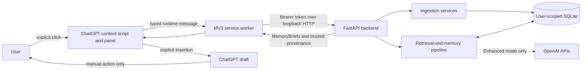
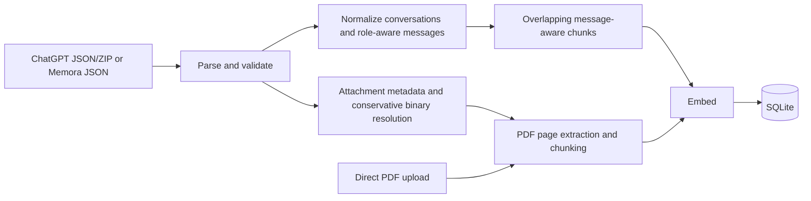

# Memora Technical Architecture

This is the canonical architecture description for the current Memora repository. It describes the implemented local MVP, not a proposed hosted platform. Product positioning belongs in `PRODUCT.md`; installation belongs in `SETUP.md`; security reporting belongs in `SECURITY.md`.

Documentation audit baseline (2026-07-21): the repository contains 101 Python test methods, and the extension suite passes 78 tests across 12 Vitest files. Counts are evidence from this audit rather than an architectural invariant.

## 1. System overview

Memora is a local retrieval and memory-reasoning layer for ChatGPT. A Chrome extension lets the user explicitly search previously imported conversations and PDFs. A loopback FastAPI service retrieves evidence from a user-scoped SQLite database, organizes it into query-specific memory structures, and returns concise, sourced MemoryBriefs. The user may insert one brief into the ChatGPT composer and then decide whether to send the message.

The architecture is local-first:

- imported content and embeddings are stored in a local SQLite file;
- the API listens on loopback rather than a public interface;
- the extension communicates with the API through its Manifest V3 service worker;
- Local mode performs all memory processing locally;
- Enhanced mode optionally sends bounded evidence to OpenAI for embeddings, fact extraction, and synthesis.

Memora is not a chat model, does not read ChatGPT history from the page, and does not automatically retrieve, insert, or submit anything.

## 2. High-level architecture



The repository is a modular monolith. Domain types and protocols stay independent from FastAPI, SQLite, Chrome, and provider SDKs. Composition occurs in `backend/api/app.py` and `backend/api/service.py`.

## 3. Chrome extension architecture

### Manifest V3 components

`extension/manifest.json` declares a Manifest V3 extension with:

- a module service worker (`background.js`);
- content scripts for `chatgpt.com` and `chat.openai.com`;
- a popup used as the Memory Control Center;
- `storage` permission and explicit loopback host permissions for `127.0.0.1` and `localhost`.

It does not request broad browsing history or arbitrary-host access.

### Content script and site adapter

`content.ts` coordinates the page-facing workflow. `ChatGptAdapter` isolates ChatGPT DOM discovery, draft reading, change observation, and insertion. The adapter boundary contains the site-specific fragility; retrieval and API code do not depend on ChatGPT selectors.

The content script:

1. validates that the page and draft input are available;
2. extracts and bounds the current draft query;
3. asks the panel to show staged loading text;
4. sends `{ type: "MEMORA_RETRIEVE_CONTEXT", query }` through `chrome.runtime.sendMessage`;
5. validates the typed response before rendering;
6. inserts a selected MemoryBrief only after **Use This Context** is clicked.

The inserted block is based on a snapshot of both the retrieved query and selected brief. If the draft changed after retrieval, insertion is refused so the extension does not overwrite newer user work. Duplicate insertion is also detected. It never triggers ChatGPT submission.

### Service worker

The service worker is the privileged network boundary. Its runtime listener strictly accepts only the two-field retrieval message, returns `true` to keep the callback response channel open during asynchronous work, and delegates to `handleBackgroundRequest`.

The handler loads the backend URL and top-k setting from synchronized storage and the local bearer token from extension-local storage. It validates settings, confirms the required loopback host permission, performs an authenticated statistics check, and then calls `MemoraApiClient.retrieve`. A content-script message cannot supply a backend URL, token, user ID, provider, or arbitrary endpoint.

API/network errors, authentication failures, configuration errors, no-imported-memory state, invalid responses, and extension-messaging failures remain distinct typed outcomes. Response parsers reject malformed backend data before it reaches the panel.

### Panel and repeated search

`MemoraPanel` lives in a Shadow DOM overlay to isolate styling from ChatGPT. The draggable position is stored locally, clamped to the viewport, and kept clear of the composer. The panel preserves explicit open/minimize and drag behavior.

After a successful retrieval it displays up to five cards, the query for which they were retrieved, and a sticky toolbar:

- **Search current prompt** performs a new explicit retrieval without requiring the panel to close;
- **Clear results** clears only transient result/UI state;
- **Best match** preserves backend ranking;
- **Most recent** reorders the already returned cards by trusted backend timestamp.

`LatestRequestGuard` gives each retrieval a generation. Only the current generation may update the UI, so a slow earlier response cannot overwrite a newer search. Clearing results or durable memory invalidates outstanding requests.

### Popup / Memory Control Center

The popup configures the loopback URL and local token, verifies authenticated readiness, imports ChatGPT JSON/ZIP exports, imports text-based PDFs, reports stored memory counts, and provides confirmed deletion. Token storage is restricted to trusted extension contexts. Durable deletion is separate from panel result clearing.

## 4. Backend architecture

### API layer

FastAPI exposes:

| Method and path | Purpose |
| --- | --- |
| `GET /health` | Minimal unauthenticated process health check. |
| `GET /api/v1/memory/stats` | Authenticated user-scoped durable record counts. |
| `DELETE /api/v1/memory` | Authenticated, body-free user-scoped deletion. |
| `POST /api/v1/conversations/import` | Import the simple Memora conversation format. |
| `POST /api/v1/import/chatgpt` | Import bounded ChatGPT JSON/ZIP uploads and recover attachments. |
| `POST /api/v1/import/documents` | Import bounded text-based PDF uploads. |
| `POST /api/v1/context/retrieve` | Run retrieval, memory reasoning, and synthesis. |

Pydantic schemas bound request fields. A custom validation handler returns only bounded location, type, and sanitized messages; rejected values are not reflected. Upload count/size limits, query/context bounds, and in-process import/retrieval rate limits constrain work before expensive provider calls.

### Authentication and user scope

All `/api/v1/*` routes require the dedicated local bearer token. `LocalSecurityConfig` validates the configured token and user ID, rejects missing/duplicate/malformed authorization, and compares token bytes in constant time. The authenticated configuration supplies the user ID; clients do not select it.

The API is intended to bind to `127.0.0.1`. CORS permits only configured origins, while bearer authentication remains the authority boundary. The rate limiter is per-process and keyed by server-derived user and operation; it is abuse resistance for the local MVP, not distributed quota enforcement.

### Service composition

`MemoraService` composes importers, the role-aware chunker, embedding provider, `SQLiteVectorStore`, semantic retriever, hybrid reranker, thread grouper, fact extractor, synthesizer, and compact legacy context builder. These dependencies are explicit and replaceable in tests.

## 5. Data model and persistence

SQLite is initialized with foreign keys and the following durable records:

| Record | Important content and provenance |
| --- | --- |
| `users` | User scope and creation time. |
| `conversations` | Conversation ID, user ID, title, and timestamps. |
| `messages` | Message ID, conversation/user IDs, role, content, and timestamp. |
| `chunks` | Role-labelled text, source message IDs, ordinal, vector, embedding provider/model, and creation time. |
| `attachments` | Attachment ID, conversation/message IDs, filename, MIME type, size, library reference, linked document, resolution status, and import time. |
| `documents` | Document ID, user ID, filename, content hash, optional parent conversation, page count, extraction status, and import time. |
| `document_chunks` | Page-bounded text, ordinal, vector, embedding provider/model, and creation time. |

Indexes support user-scoped chunk lookup, attachment lookup, and document hash deduplication. Search loads only the authenticated user's conversation/document chunks, verifies embedding provider/model compatibility, computes cosine similarity, deduplicates equivalent content, and carries source metadata into `RetrievalResult`.

Memory statistics count conversations, conversation chunks, attachments, documents, and document chunks. Deletion removes one user's linked records in a safe order and uses SQLite secure deletion as defense in depth.

The following objects are **not** stored:

- `MemoryThread`: a query-specific grouping of eligible evidence;
- `MemoryFact`: a query-time typed statement extracted from one thread;
- `MemoryBrief`: a query-time presentation object synthesized from one thread;
- panel result state and sorting preference for a returned result set.

This separation avoids turning provider inferences into permanent facts without an explicit lifecycle and consent model.

## 6. Ingestion pipeline



### Conversations and chunking

The simple importer accepts documented conversation objects and validates IDs, titles, roles, content, and timestamps. ChatGPT export parsing reconstructs the active message tree rather than blindly ingesting every branch, ignores unusable/system-only material, and preserves stable provenance.

`ConversationChunker` works across normalized messages with configurable token-sized bounds and overlap. Rendered chunks retain role labels and the contributing source message IDs. This keeps dialogue meaning and traceability while producing retrieval-sized evidence.

Embeddings are generated in batches and stored together with their provider/model identity. A repeated import is deduplicated by stable identifiers and content hashes where applicable.

### Attachments and PDFs

ChatGPT exports may contain attachment metadata whose binary appears elsewhere in the archive. Resolution is conservative: metadata is correlated with archive/library candidates, ambiguous or missing references stay explicitly marked, and only supported resolved PDFs enter document ingestion. Metadata-only attachments remain useful provenance without pretending their contents were indexed.

PDF ingestion accepts bounded text-based PDFs, extracts text page by page, chunks without crossing unrecorded page provenance, embeds the chunks, and records inclusive `page_start`/`page_end`. Direct PDF imports and recovered attachment PDFs use the same durable document model. Scanned/image-only and encrypted PDFs are not OCR'd.

## 7. Retrieval and memory pipeline


### Semantic eligibility

For a normal query, `SemanticMemoryRetriever` embeds the query and asks the vector store for a candidate pool of at least 20 records. Cosine similarity is computed against compatible vectors from conversation and document chunks. The effective threshold is the maximum of the request threshold and the provider-calibrated minimum. Later lexical signals cannot rescue evidence that failed semantic eligibility.

A query containing one explicit course code has a dedicated scope path. The code is normalized (for example `COMP472`, `COMP-472`, and `COMP 472`) and candidates are restricted to the trusted matching course scope. A broad code-only query can avoid embedding; a more specific query still uses compatible semantic scoring inside the scope.

### Hybrid reranking and diversity

`HybridReranker` gives semantic similarity 0.75 weight, content-term overlap 0.15, and title overlap 0.10, then applies bounded trusted-entity/academic adjustments. Exact requested course codes are strongly favored and conflicting explicit codes are penalized. This improves precision while leaving semantic eligibility dominant.

Candidates are ordered deterministically. `MemoryThreadGrouper` acts as the principal diversity boundary: it prefers separate threads and merges evidence only when subject, course/academic focus, version markers, and goal signatures support the same interpretation. The retrieval service groups and returns at most five threads, and `top_k` may reduce that number further.

## 8. MemoryThreads

A `MemoryThread` is a query-specific bundle of evidence believed to concern the same subject, topic, goal, and version. It records its strongest semantic/hybrid scores and trusted source conversation IDs/titles, chunk IDs, message IDs, timestamps, document/page sources, and attachments.

Threading exists because adjacent semantic matches are not necessarily one memory. Synthesizing an old plan, a revised plan, a different person, and an unrelated course together creates plausible but false summaries. Conservative grouping reduces this cross-topic contamination and allows each potential memory to be ranked and synthesized independently.

Threads are built for the current candidate set and query. They are not durable entities and have no independent lifecycle in SQLite.

## 9. MemoryFacts

A `MemoryFact` is a compact typed statement extracted from one thread for the current query. The implemented categories are:

`fact`, `decision`, `goal`, `preference`, `constraint`, `result`, `status`, `problem`, `solution`, `correction`, and `open_loop`.

Local extraction deterministically selects worthwhile user-authored statements, classifies them with bounded rules, and scores salience/specificity. Enhanced extraction asks the provider for bounded structured proposals and then attaches provenance in backend code. Provider failure falls back to deterministic extraction.

The selector ranks facts using 45% query relevance, 23% salience, 17% specificity, 5% title/entity relevance, 4% recency, and 6% temporal intent. Near duplicates merge their provenance. Corrections replace or suppress related superseded statements where the relationship is strong. At most eight selected facts drive a thread, with bounded raw evidence retained as fallback context.

Facts are query-dependent because usefulness, temporal interpretation, and even which detail should represent a thread depend on the new question. They are not durable memory records.

## 10. Temporal and current-state reasoning

Temporal ranking is applied only after semantic eligibility and thread construction. It does not implement “newest always wins.”

For ordinary/current-state queries, thread utility is:

```text
0.70 hybrid relevance
+ 0.12 fact quality
+ 0.06 relative recency
+ 0.12 current-state strength
- 0.08 superseded-state penalty when applicable
```

For queries with historical intent, utility is:

```text
0.70 hybrid relevance
+ 0.12 fact quality
+ 0.15 historical-state match
+ 0.03 preference for older evidence
```

Recency decays gradually against the newest candidate timestamp and retains a floor, so older high-relevance evidence remains viable. Status/decision/solution language and explicit current-state terms support a current interpretation. Correction facts receive the strongest current-state signal. Historical queries instead favor evidence marked as old, previous, or original. These heuristics are deterministic and intentionally conservative; they are not a general temporal knowledge graph.

## 11. MemoryBrief synthesis

Each selected thread is synthesized separately. No provider prompt contains multiple threads. This prevents one source group from contaminating another and makes failure containment simple.

The synthesizer receives bounded evidence (maximum 12,000 characters), explicit untrusted-evidence delimiters, and the current query only as context. Its job is to produce a short title, a two-to-four sentence memory summary, and two-to-five details—not answer the user's new question. Structured validation rejects filler, oversized output, duplicates, and malformed responses.

Local mode renders deterministic evidence-only briefs. Enhanced mode uses one structured OpenAI request per thread. `ResilientMemorySynthesizer` falls back per thread if the provider fails or returns invalid output, allowing other threads to succeed. The extension indicates when a fallback was used.

## 12. Trusted provenance

Provenance is carried from storage through retrieval, threads, and briefs. It includes, as applicable:

- conversation ID and title;
- message and chunk IDs;
- attachment ID, filename, MIME type, conversation/message link, and resolution status;
- document ID and filename;
- inclusive PDF page range;
- source/import timestamps used for display and temporal ranking.

Provider output is allowed to propose only brief content. Backend code attaches source objects afterward from stored metadata. The LLM cannot create the citations displayed by the extension. This boundary makes sources inspectable and prevents a fluent model response from being treated as provenance.

## 13. Local mode and Enhanced mode

| Capability | Local mode | Enhanced mode |
| --- | --- | --- |
| Embeddings | Deterministic 1,024-dimensional feature hash | OpenAI embedding model configured by the backend |
| Fact extraction | Deterministic bounded rules | Structured OpenAI extraction with deterministic fallback |
| Brief synthesis | Deterministic evidence rendering | Structured OpenAI synthesis with per-thread fallback |
| API key | Not required | `OPENAI_API_KEY` in backend environment only |
| Intended use | Offline-friendly development, tests, simple local operation | Higher-quality semantic retrieval and summaries |

The launcher configures the three provider choices consistently. Stored vectors include provider/model metadata, and dimension checks prevent accidental comparison across incompatible embedding spaces. Switching embedding providers normally requires re-indexing or a separate compatible database.

## 14. Security architecture

Security boundaries are deliberately scoped to a single-user local MVP:

- **Network:** Uvicorn binds to loopback; the extension has only localhost host permissions.
- **Authentication:** a high-entropy dedicated bearer token protects every memory API route. It is distinct from the OpenAI key.
- **Identity:** the backend maps the token to configured `MEMORA_USER_ID`; client payloads cannot select another user.
- **Extension:** untrusted page code cannot directly access extension APIs. The content script sends a narrow validated message; the service worker owns credentials and HTTP.
- **Credentials:** the bearer token is kept in restricted local extension storage; the OpenAI key stays in the backend environment.
- **Inputs:** schema bounds, upload limits, archive/PDF validation, request timeouts, rate limits, and sanitized validation errors limit resource use and reflection.
- **Provider boundary:** imported text is delimited as untrusted evidence; model outputs are structured and bounded; provider-created citations are discarded.
- **Outputs:** context and brief fields are bounded, and the UI assigns retrieved text with `textContent` rather than HTML.
- **Deletion:** the popup requires an explicit confirmation and invokes user-scoped database deletion; panel clearing is non-destructive.

Indirect prompt injection remains a residual risk: hostile text can influence relevance or synthesis even though instructions say not to follow it and outputs are validated. The local token is a capability for one local installation, not production multi-user identity. SQLite is not encrypted at rest. Rate limits reset with the process. A hostile local process running as the same OS user is outside this MVP's protection boundary.

## 15. Launcher and runtime architecture

`start-memora.ps1` is the supported Windows entry point and remains compatible with Windows PowerShell 5.1. It:

1. discovers and safely invokes individual Python candidates (including paths with spaces and `py.exe` fallback), requiring Python 3.11+;
2. discovers Node and npm without concatenating multiple command results, requiring Node 20+;
3. creates or repairs `.venv` based on interpreter metadata and runtime import checks, then installs the project editable and checks dependency consistency;
4. reads an allowlisted `.env` configuration without evaluating shell syntax;
5. guides Local versus Enhanced setup and obtains an OpenAI key only for Enhanced mode;
6. creates/reuses a dedicated local bearer token without logging it by default;
7. runs the production extension build when required, verifies required `dist` files, and records `.memora-build-stamp` so stale detection is based on source state rather than incidental directory timestamps (tests and typechecking remain explicit development commands);
8. starts Uvicorn with an explicit project working directory on loopback;
9. waits for health and then performs authenticated memory-statistics readiness before declaring success.

`-Setup` revisits configuration, `-RebuildExtension` forces a production build, and `-ShowToken` explicitly displays the local token. Port conflicts and malformed/missing runtimes are reported distinctly. The launcher does not make a provider request as a readiness test.

## 16. End-to-end request flow

1. The user types a question in the ChatGPT composer.
2. The user opens Memora and clicks **Retrieve memory** (or **Search current prompt** after an earlier result).
3. The content script snapshots and validates the draft, starts a request generation, and shows staged loading text.
4. A narrow retrieval message crosses the Chrome runtime boundary.
5. The service worker loads trusted settings, checks authenticated memory readiness, and POSTs the query/top-k to the loopback API with the bearer token.
6. FastAPI authenticates, rate-limits, validates, and invokes `MemoraService` with the server-derived user ID.
7. The backend retrieves semantically eligible evidence, reranks it, groups MemoryThreads, extracts/ranks MemoryFacts, performs temporal thread ranking, and synthesizes one MemoryBrief per selected thread.
8. Backend code attaches trusted provenance and returns the bounded response.
9. The service worker parser validates the response and returns it to the content script.
10. If the request generation is still current, the panel renders cards. The user may choose Best match or Most recent without another backend call.
11. The user clicks **Use This Context** on one card. The content script confirms that the draft still matches the retrieval snapshot and inserts the bounded memory block.
12. The user reviews and manually submits the final ChatGPT message. Memora never submits it.

## 17. Design decisions and tradeoffs

### Local-first modular monolith

A loopback backend and SQLite minimize operational dependencies and keep bulk history under the user's control. The tradeoff is that one machine/process owns availability, performance, backup, and filesystem security.

### Chrome extension instead of a separate chat UI

The extension adds memory to an existing workflow and avoids becoming another chatbot. ChatGPT DOM changes are therefore an unavoidable adapter maintenance risk.

### Explicit user control

Explicit search, per-card insertion, draft-change protection, and manual submission trade automation for predictability and consent. Transient clearing and durable deletion are intentionally different operations.

### Hybrid retrieval instead of pure vectors

Semantic similarity provides broad recall. Deterministic lexical/title/entity signals improve exact technical and academic matching, while a calibrated threshold prevents unrelated lexical coincidences from entering memory reasoning. The staged pipeline is more explainable but still limited by initial semantic recall.

### Query-time threads and facts

Building interpretations per query avoids permanently storing provider inferences and allows relevance/temporal intent to change with the question. It costs retrieval latency and repeats extraction work.

### Synthesis instead of raw excerpts

Per-thread briefs are easier to use than copied chat fragments and can consolidate related evidence. Synthesis introduces provider latency and indirect-injection risk, so inputs/outputs are bounded, threads stay separate, fallback is deterministic, and provenance is attached outside the model.

### SQLite and linear vector search

SQLite gives transactional local persistence, simple user-scoped deletion, and no hosted infrastructure. Cosine search currently scans the user's stored vectors in process; this is appropriate for the MVP but not large multi-user scale.

## 18. Current limitations

- Only ChatGPT is implemented as a site adapter; selectors can break when its DOM changes.
- There is no browser DOM history capture, automatic retrieval, automatic insertion, or automatic submission.
- The backend is a single local process with synchronous ingestion and in-memory rate limits.
- SQLite vector retrieval is a linear scan without an ANN index.
- MemoryThreads, MemoryFacts, and MemoryBriefs are recomputed for each query and are not inspectable durable records.
- Semantic recall and provider-specific threshold calibration remain the first retrieval ceiling.
- Exact course-code handling is a targeted heuristic, not general entity resolution.
- Temporal reasoning uses timestamps, lexical state signals, and corrections; it is not a full event timeline or contradiction solver.
- PDF support is text extraction only: no OCR, handwriting, image understanding, or encrypted-document recovery.
- Attachment recovery depends on the structure and metadata present in the supplied export; unresolved/ambiguous files remain metadata only.
- Enhanced mode can send query/evidence content to OpenAI and depends on network/provider availability; deterministic fallbacks may be less fluent.
- The local SQLite database is not encrypted at rest, and the local bearer token is not a production account system.
- Indirect prompt injection is reduced by evidence boundaries, instructions, structured output, and backend provenance, but cannot be eliminated by this design.
- No hosted synchronization, multi-device continuity, multi-user administration, billing, or distributed scaling is implemented.
