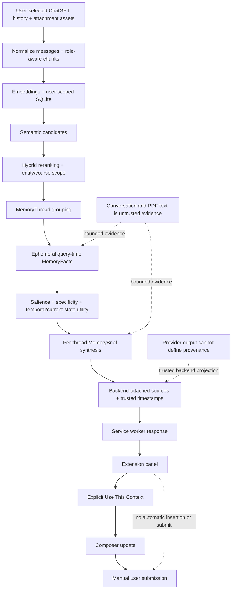

# Memora MVP Architecture

Memora is a local modular monolith plus a thin Manifest V3 extension. This document describes the code that exists today; it is not a future architecture plan.

## End-to-end memory flow



The content script never calls the backend directly. Cross-origin HTTP runs in the service worker using manifest host permissions. Sensitive endpoints authenticate a dedicated local bearer token and derive database scope from server-side `MEMORA_USER_ID`. OpenAI keys stay in the backend process.

## Ingestion

```text
User-selected ChatGPT JSON/ZIP
  -> extension popup
  -> POST /api/v1/import/chatgpt
  -> ChatGPTExportImporter
  -> normalized Conversation + ordered Messages
  -> ConversationChunker
  -> EmbeddingService
  -> SQLiteVectorStore
```

ZIP entries are inspected in memory and are not extracted. The importer reconstructs the active branch of ChatGPT graph exports, accepts supported flat formats, skips unsupported content, and preserves source provenance. A user-scoped normalized fingerprint skips unchanged re-imports; changed conversations replace their prior chunks.

Conversation import indexes textual user/assistant message strings and stores structured attachment metadata separately. For supported ChatGPT ZIP exports, message attachments are joined conservatively to library origin records, opaque asset-name mappings, and manifest paths. Exactly one signature-validated PDF may enter Document Memory; unresolved or ambiguous attachments remain metadata-only memories. Extraction runs locally with `pypdf`; scanned/image-only and password-protected PDFs are rejected without OCR.

The additive `attachments` table retains user, conversation, message, sanitized filename, MIME/size metadata, optional library/document links, and resolution status. Existing conversation/document tables are preserved. Manifest positions do not establish ownership, paths cannot escape the archive root, and opaque `.dat` files are treated as PDFs only after `%PDF-` validation. Linked attachments and documents inherit a single-course parent scope; ambiguous multi-course parents require explicit evidence.

The local `scripts.import_chatgpt_export` entry point adapts an already-extracted directory to this same ingestion service. It processes conversation shards individually and reads only resolved asset candidates, avoiding construction or upload of a giant in-memory ZIP. Local path acceptance exists only at this explicit CLI boundary; the HTTP API and extension do not accept filesystem paths.

The direct `POST /api/v1/conversations/import` endpoint accepts Memora's documented single-conversation JSON shape.

## Retrieval and memory intelligence

`ConversationChunk` is the active retrieval unit. It retains user ID, conversation ID/title, chunk ID/ordinal, text, and source message IDs. Chunk text preserves message roles. Embeddings are created by either:

- `OpenAIEmbeddingService` for semantic demo retrieval; or
- `LocalHashEmbeddingService` for deterministic offline tests and a lexical baseline.

The selected provider and model are stored with vectors. Memora rejects retrieval across incompatible vector spaces so changing provider/model requires re-indexing.

`SQLiteVectorStore` filters by `user_id` before cosine ranking and applies the calibrated semantic eligibility threshold. `SemanticMemoryRetriever` returns a 20-candidate internal pool. A deterministic hybrid reranker combines cosine similarity with significant query-term overlap in chunk text and conversation titles. It normalizes generic academic identifiers such as `COMP472`, `COMP 472`, and `COMP-472` to `COMP 472`; an exact requested-code match receives a strong bonus, while a candidate containing only a different explicit code receives a penalty. Academic intent terms add a smaller signal. These adjustments operate only on candidates that already passed semantic eligibility.

`MemoryThreadGrouper` conservatively separates evidence by explicit subject, distinctive goal/project terms, conversation provenance, version markers, and normalized course identity. Different explicit course codes cannot merge. Conversations with the same code and academic subtask may merge, while assignments, practice exams, final-exam preparation, and course-material discussions remain distinct subthreads. It ranks and selects at most five threads.

Every query containing exactly one strict course identifier establishes a user-scoped course boundary before ranking. SQLite derives conversation membership from normalized codes in trusted titles, messages, and chunks. A single-course conversation contributes later chunks even when they do not repeat the identifier. Broad course browsing uses equal initial scores, while assignment, exam, project, lecture, and similar task-bearing queries use embeddings to rank only within the scoped course evidence. Exact course membership bypasses the global semantic floor because the validated identifier is sufficient membership evidence. Bare numbers and ordinary phrases such as `project 290` do not activate course scoping.

Multi-course conversations are handled conservatively: only chunks explicitly containing the requested code, and no conflicting code, are eligible. Unlabelled chunks from an ambiguous conversation are excluded. This favors precision over recall until document/chunk-level course attribution is modeled explicitly.

Each selected thread first passes through a bounded `MemoryFactExtractor`. This query-time stage is active today, but its MemoryFacts are ephemeral for the request and are not persisted as durable database records. It discards filler and extracts concise user-centric facts typed as facts, decisions, goals, preferences, constraints, results, status, problems, solutions, corrections, or open loops. The model may propose only the type, text, salience, and specificity; Memora attaches trusted thread provenance afterward. Fact utility uses 45% query overlap, 23% historical salience, 17% specificity, 5% title/entity overlap, 4% gentle relative recency, and 6% explicit current-state or historical-intent alignment. Near-duplicates collapse, and explicit corrections replace sufficiently related older claims while retaining merged provenance. Conflicts without explicit correction remain visible.

After extraction, the already-eligible threads receive a deterministic temporal/current-state score: 70% existing hybrid relevance, 12% strongest fact quality, 6% gentle recency, and 12% explicit current-state evidence. Explicit old/original markers receive a small penalty for ordinary broad queries. For explicitly historical queries, that preference is inverted: 70% hybrid relevance, 12% fact quality, 15% historical-marker alignment, and only 3% inverse recency. Current, latest, updated, revised, switched, changed, final-design, and correction language therefore matters more than timestamp alone. Recency uses a two-year gentle curve with a 0.25 floor and can never make an ineligible memory eligible. Stable old goals and constraints remain viable when semantically relevant.

Conversation chunks retain the latest reliable source-message timestamp, falling back to trusted conversation update/create time and finally import time. `MemoryBrief.latest_timestamp` exposes only the latest reliable thread timestamp. The extension formats this as a compact recency label and can reorder the already-returned cards by timestamp without another retrieval request.

Databases indexed before temporal provenance was introduced contain chunk import times rather than historical source times. Re-import/re-index the conversation export once before evaluating temporal ranking against an existing database.

Alternatively, `python -m scripts.backfill_memory_timestamps` performs a user-scoped, update-only metadata repair using `MEMORA_DATABASE_URL` and `MEMORA_USER_ID`. It selects the latest valid source-message timestamp, then conversation update time, then conversation creation time, and otherwise preserves the existing timestamp. Recovered document chunks use their linked attachment-message timestamp or parent-conversation fallback; standalone documents retain import time. The command never loads an embedding or synthesis provider and never changes text, vectors, IDs, provenance, or import fingerprints. It is transactional and idempotent, and prints aggregate counts only. Stop the backend before running it so SQLite is not concurrently serving requests.

Only evidence from the final selected threads (at most five) is extracted; Memora never scans the full chunk store at query time. Each extraction is bounded to 12,000 evidence characters and 12 proposed facts, then at most eight ranked facts drive synthesis with a 2,000-character raw-evidence fallback. With the OpenAI provider this adds up to one structured extraction request per selected thread before the existing synthesis request, so latency grows with the number of returned threads. The current `synthesis_ms` metric includes both fact extraction/ranking and brief synthesis. Persistent precomputation is deferred until usage warrants the added lifecycle complexity.

Each fact-enriched thread is independently passed to the configured `MemorySynthesizer`. The OpenAI implementation makes one Responses API Structured Outputs request per thread and permits the model to propose only `title`, `summary`, and `key_details`. Memora attaches subject and all provenance afterward. `ResilientMemorySynthesizer` contains provider or validation failures to one thread and creates a bounded deterministic evidence-only fallback. The API exposes sanitized MemoryBriefs alongside transitional legacy fields, and the extension renders up to five separate cards.

## Browser extension

- `ChatGptAdapter` isolates ChatGPT DOM selectors and draft mutation.
- `content.ts` owns explicit retrieve/use actions and panel state.
- `messaging.ts` defines the content-to-background request path.
- `background-listener.ts` keeps the asynchronous response channel open.
- `background-handler.ts` loads settings, checks host permission, and invokes the API client.
- `popup.ts` owns settings, authenticated readiness, explicit history import, and privacy controls.

Readiness calls authenticated memory statistics rather than relying on public health. It distinguishes ready, empty-memory, authentication, offline, and deterministic configuration failures without invoking provider-backed retrieval. Retrieval loading copy changes at fixed elapsed intervals for user feedback; it is not a stream of backend progress events.

Retrieval does not capture the current conversation, run automatically, inject automatically, or submit messages. If the draft changes after retrieval, insertion is refused to protect the user's edits. A user explicitly selects one synthesized brief, which is labeled untrusted reference data and enclosed in escaped `<memory_context>` delimiters.

## Storage and privacy boundaries

Every persisted conversation, chunk, fingerprint, and retrieval query is scoped by the authenticated server-configured `MEMORA_USER_ID`; clients cannot choose it. The dedicated local token is a single-user hackathon control, not production authentication. Conversation content and embeddings are sensitive local data; the SQLite file is ignored by Git and should not be shared.

Query-time MemoryFact extraction is active and ephemeral. Durable persisted MemoryFacts remain a separate future storage and lifecycle boundary. The active MVP retrieves raw chunks as internal evidence, groups them into MemoryThreads, extracts and ranks bounded facts for the current query, and exposes synthesized MemoryBriefs rather than raw chat dumps as the primary experience.

## Operational limits

- One local FastAPI process and SQLite database
- Linear in-process vector scan
- Synchronous import/indexing
- One ChatGPT adapter with selectors that may require maintenance
- Localhost backend permissions only
- Dedicated local bearer authentication and in-process abuse limits; no production multi-user authentication
- Query limit 2,000 characters, `top_k` 1–10, and at most 10 selected import files
- No encryption, background queue, cloud deployment, telemetry, or analytics
## Privacy control plane

`GET /api/v1/memory/stats` returns only user-scoped aggregate counts. `DELETE /api/v1/memory` accepts no body or client-selected user ID and transactionally removes the authenticated server-configured user's attachments, documents/document chunks, conversations/messages/chunks, and user row. Foreign-key ordering removes attachment links first, then documents, then conversations. Retrieval has no result cache, so subsequent requests observe the empty database immediately; deleting conversation rows also removes import fingerprints and permits later re-import.

The popup requires an explicit confirmation click, disables destructive controls while the request is active, and notifies open ChatGPT content scripts to clear retrieved-card and used-memory state. It never removes text already inserted into the composer. Statistics and deletion use the same localhost bearer-token boundary as retrieval and import.
