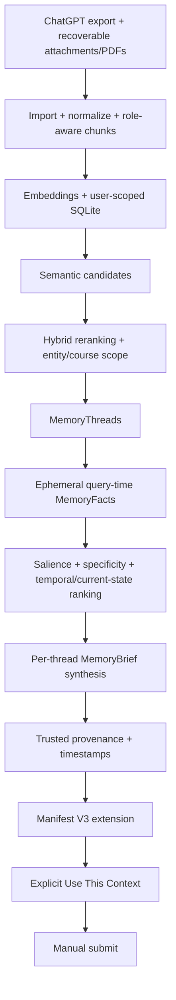

# Memora Technical Overview

Memora is a local modular monolith behind a thin Manifest V3 Chrome extension. Domain interfaces keep import, embeddings, storage, retrieval, memory organization, and synthesis replaceable without coupling them to FastAPI or Chrome.

## Architecture

Historical conversation and document text is treated as untrusted evidence inside bounded extraction and synthesis prompts. Models can propose facts and brief text, but trusted provenance and timestamps are attached by backend code.

## Ingestion and document memory

The explicit history-import endpoint accepts supported JSON files or one ZIP. The importer reconstructs the active branch of ChatGPT graph exports, accepts supported flat formats, skips unsupported content, retains stable source-derived identifiers, and uses a normalized SHA-256 fingerprint for user-scoped duplicate detection. Changed conversations replace their previous normalized content and chunks.

For supported exports, Memora conservatively joins message attachment metadata, library origins, opaque filename maps, and manifest paths. Strong identifiers win; ambiguous mappings are refused. Safely resolved, signature-validated text PDFs are extracted locally with `pypdf` under file, page, text, and chunk limits. Documents retain sanitized filenames and page provenance. Unresolved attachments remain metadata-only. OCR, scanned/image-only or encrypted PDFs, remote URLs, and arbitrary embedded assets are unsupported.

Large already-extracted exports can use `python -m scripts.import_chatgpt_export <directory>`. It processes shards incrementally through the same services and reports bounded aggregate information only.

## Embeddings and storage

`LocalHashEmbeddingService` supplies deterministic feature-hash vectors for offline tests and baseline evaluation. `OpenAIEmbeddingService` batches semantic embeddings using `text-embedding-3-small`. Stored provider/model identity and vector dimensions must match the active service; incompatible spaces fail instead of being compared.

`SQLiteVectorStore` persists user-scoped conversations, normalized messages and roles, conversation chunks, attachments, document chunks, embeddings, fingerprints, and provenance. Search filters by server-derived user scope before cosine similarity. Its linear application-process scan is intentionally simple and suitable only for the hackathon dataset.

## Retrieval and memory intelligence

Ordinary retrieval applies an embedding-space-specific eligibility floor and returns a larger internal candidate pool. A deterministic hybrid reranker combines cosine similarity, significant content/title overlap, exact course-code evidence, mismatch penalties, academic intent, and document intent. A query containing exactly one strict course identifier can establish a narrow user-scoped course boundary; ambiguous multi-course chunks are handled conservatively.

`MemoryThreadGrouper` separates subjects, projects, tasks, courses, and explicit versions. Cross-conversation evidence merges only with strong subject and goal continuity. This keeps unrelated memories out of one synthesis request.

Each selected thread then undergoes bounded `MemoryFactExtractor` processing. **Query-time MemoryFact extraction is active.** The ephemeral facts capture user-centric decisions, constraints, preferences, status, problems, corrections, and other useful evidence for that request. They are not persisted; durable stored MemoryFacts remain future work.

Fact utility combines query fit, historical salience, specificity, entity/title overlap, gentle recency, and explicit current-state or historical intent. Near-duplicates collapse. Explicit corrections can replace sufficiently related older claims while retaining merged provenance; unresolved conflicts remain visible. Thread ranking combines existing relevance, strongest fact quality, trusted timestamps, and current/historical markers. Recency cannot make semantically ineligible evidence eligible.

Each final thread is synthesized independently into a `MemoryBrief`. OpenAI Structured Outputs may propose only title, summary, and key details; the backend attaches subject, sources, and timestamps. Provider refusal, timeout, malformed output, or one-thread failure falls back independently to a bounded deterministic evidence brief.

## Extension and explicit insertion

The content script reads only the current draft after an explicit click and sends a typed runtime message to the service worker. The worker validates settings and host permission, authenticates to the fixed localhost backend, and returns the API response. The content script never directly fetches the backend, and no OpenAI key exists in extension settings, messages, or bundles.

The panel displays up to five cards, defaults to **Best match**, and can reorder returned cards by **Most recent** without another request. **Use This Context** inserts only the selected brief inside escaped, labeled `<memory_context>` boundaries. It refuses to overwrite a changed draft and never submits.

The popup checks readiness through authenticated aggregate memory statistics—not public health alone—and never invokes provider-backed retrieval. It distinguishes **Ready**, **No memory imported yet**, **Authentication failed**, **Memora is offline**, and **Configuration unavailable**. Retrieval feedback changes at 0, 7, and 16 seconds based only on elapsed time; these messages are not backend progress events. Client waiting is bounded to 60 seconds.

## Privacy and security boundaries

- Imported content, embeddings, recovered document text, and provenance are stored in the configured local SQLite database.
- When OpenAI providers are enabled, bounded text may be sent for embeddings, query-time MemoryFact extraction, and MemoryBrief synthesis; credentials stay in the backend environment.
- Sensitive endpoints require a dedicated local bearer token and derive user scope from server-side `MEMORA_USER_ID`.
- Imports, queries, validation errors, and provider boundaries are bounded and sanitized.
- Historical evidence is untrusted, DOM output uses safe rendering, and insertion and submission remain user-controlled.
- Authenticated aggregate statistics and two-step deletion support inspection and clearing of active database records.

These controls fit a localhost single-user MVP. They are not production multi-user authentication, encrypted-at-rest storage, end-to-end encryption, or zero-knowledge processing.

## Evaluation claims

The semantic retrieval fixture contains 15 paraphrased positive queries across five synthetic topics and five negative/no-match queries. The local feature-hash baseline achieved 46.7% positive Top-1 and 5/5 negative abstention with its calibrated floor. OpenAI `text-embedding-3-small` previously achieved 15/15 positive Top-1 and Top-3. Live OpenAI evaluation is opt-in.

Those figures measure semantic candidate retrieval—not the complete MemoryThread, MemoryFact, temporal ranking, and MemoryBrief pipeline. Reranking and end-to-end behavior have separate deterministic tests. No comparative full-pipeline Memora-versus-basic-RAG benchmark currently exists.

## Current verification

- Backend behavior and integration tests: **101/101 passed**
- Extension Vitest/jsdom tests: **72/72 passed**
- Python compilation: **passed**
- TypeScript strict typecheck: **passed**
- Production extension build: **passed**
- Manual browser retrieval and explicit insertion flow: **verified**

Automated tests use deterministic local or mocked providers and do not require live OpenAI calls.

## Current limitations

- Developer-operated local FastAPI service and unpacked Chrome extension.
- No production multi-user identity or encrypted-at-rest database guarantee.
- SQLite linear vector scan and synchronous import/indexing.
- Query-time MemoryFact extraction and per-thread synthesis add provider latency.
- Prompt-injection risk is reduced but cannot be fully eliminated.
- ChatGPT DOM selectors and export schemas may change.
- Not every historical attachment is recoverable; scanned PDFs require unsupported OCR.
- ChatGPT is the only implemented adapter; durable persisted MemoryFacts are not implemented.
